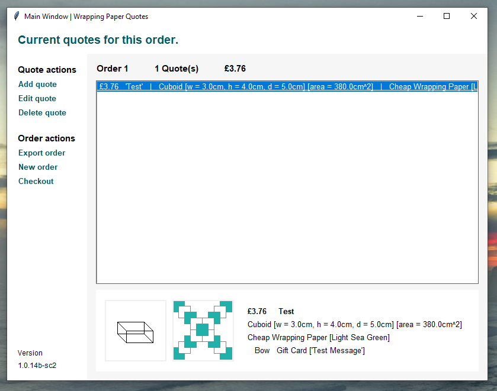
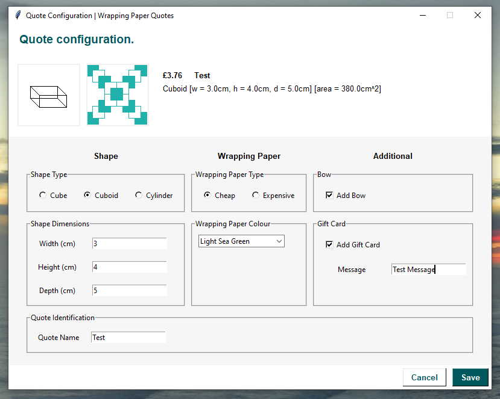

# Wrapping Paper Quotes Calculator

> [!Note] 
> This is a program to demonstrate a 'proof of concept' for a department, who provide gift wrapping services based on the shape of the present. In this scenario, only an employee of the department can use this program. The assignment stated that all code must be within one python file. This program will not be worked on or maintained.

This is code that was submitted as an assignment.
* Submitted: May 2022
* Module: BS1220 Introduction to Software Design &amp; Development
* Course: BSc (Hons) Computer Science

The application was written in Python, using the Tkinter GUI Framework.

## Execute

To execute the program, you can either run the single python in the file in the terminal, as shown below:

```sh
# if Windows:
python wpqc.py
# if Linux or Unix-based:
python3 wpqc.py
```

Or you may choose to use IDLE or an IDE, such as PyCharm or VSCode.

## Usage

The main window of the application is capable of showing a single order containing multiple quotes, adding up the total cost based on the specifications, as well as a preview pane towards the bottom for easier readability. These quotes can be exported to a text file.



The quote configuration window, accessed through adding or editing a quote, allows the a single quote to be customised. This involves the shape type, dimensions, wrapping paper type and colour, as well as if the customer wants to add a bow or gift card with a message. Also, calculating the price as being configured.



