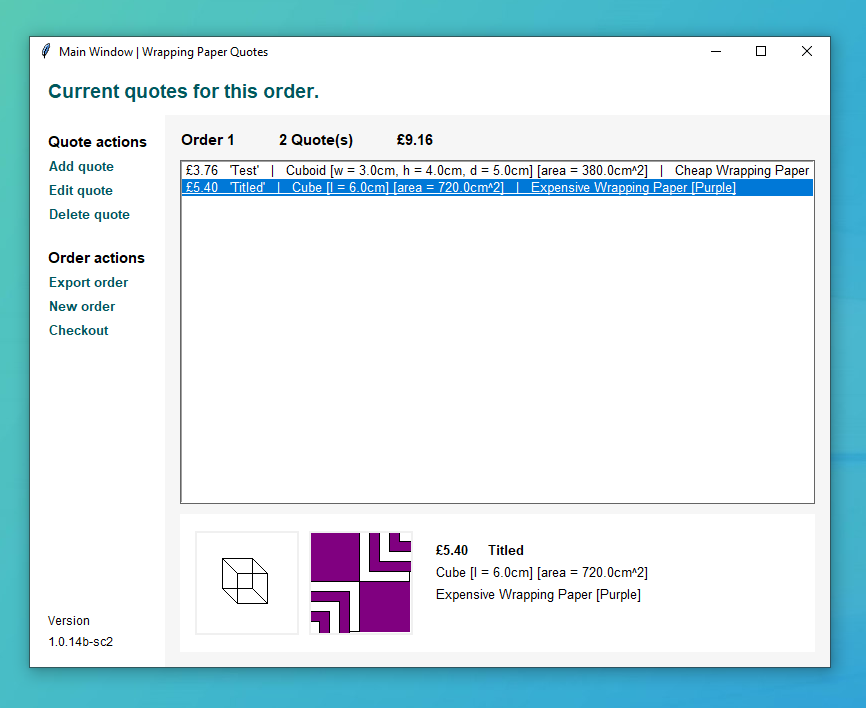
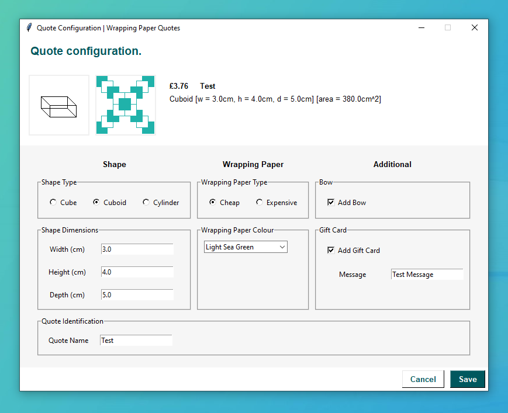

# Wrapping Paper Quotes Calculator (WPQC)


## Overview

The "Wrapping Paper Quotes Calculator" is an application for internal use within the
wrapping services department of XYZ Corporation. This "proof of concept" app calculates
costs based on present shape, size, paper type, colour preferencs and additional items -
such as a bow or a gift card, all as per the assignment requirements from the Module
BS1220 Introduction to Software Design and Development in the Computer Science course at
the University of Winchester.

## Original Requirements

* Calculate total wrapping paper costs for various present shapes based on user input
regarding dimensions (length, width, depth) and colour specification as needed. If needed,
optional items include a bow and/or a gift card with a custom message in the quote.
* The application is developed using Python (version <= 3.8) within a single file adhering
to assignment constraints for demonstration purposes -- no further development will be
pursued after the project's conclusion.
* Uses the Tkinter GUI framework, without requiring extenal IDE installation - a
limitation mandated by the assignment.

## Execution

To execute, please ensure that Python 3.8+ with Tkinter support is installed on your
system. The `wpqc.py` can be executed either through an IDE such as PyCharm or VSCode, or
through the terminal, as shown below:

```sh
# If Windows (python must be in the path environment variable).
python wpqc.py
# Unix-like or based
python3 wpqc.py
```

## Usage

### Quote Manager

The "Quote Manager" allows staff to view and finialise a list of quote items, each
representing a gift wrapping request - calculating the total cost in real time on your
screen within the interface. The window supports creating, editing and deleting quotes.
Additionally, staff may export the quote list into a receipt format (to a .txt file),
before checking out.



### Quote Editor

The "Quote Editor" allows staff to edit existing or create new quotes, providing realtime
price calculation, based on the options chosen including: dimensions, colour, wrapping
design, and whether a bow and/or gift card is required.

